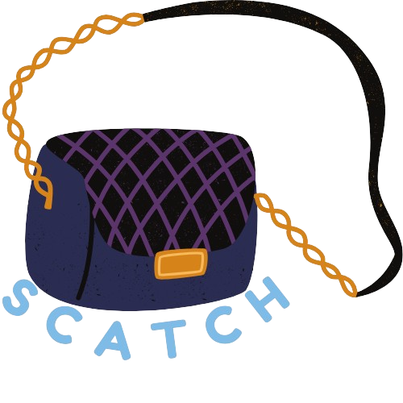

# 🎒 Scatch - A Premium Bag Shop 👜

## Overview ✨

**Scatch** is a user-friendly e-commerce platform designed for premium bag enthusiasts. With an elegant interface and robust functionality, Scatch allows users to effortlessly explore, shop, and manage their accounts. This project highlights the blend of web development and responsive design to deliver a seamless shopping experience. 🌟

## Live Project Link 🌐

Check out the live project here: [Scatch](https://scatch-6sgl.onrender.com)

## Technologies Used 🛠️

- **Node.js**: For server-side functionality and backend logic. 🌐
- **Express.js**: To manage routing and middleware. 🚦
- **MongoDB**: For storing user and product data securely. 📦
- **EJS**: To dynamically render HTML templates. 📄
- **Tailwind CSS**: For crafting responsive and modern UI. 🎨

## Key Learnings 📚

- Enhanced understanding of **Express.js** for routing and middleware setup. 🔍
- Gained hands-on experience in designing responsive layouts using **Tailwind CSS**. 📱
- Developed knowledge of integrating **MongoDB** for data persistence and retrieval. 📊
- Improved ability to create dynamic, server-side rendered web applications using **EJS**. 🧩

## Key Features ⭐

- **Account Management**: Users can register and log in to their accounts securely. 👤
- **Dynamic Error Notifications**: Real-time error display with dismissible messages. ⚠️
- **Responsive Design**: Optimized for all devices, from mobile to desktop. 📏
- **Stylish UI**: Crafted with Tailwind CSS to create a visually appealing experience. 🖌️

## Additional Future Features 🚀

- **Product Listing**: Display a catalog of premium bags for users to explore. 🛍️
- **Cart Functionality**: Allow users to add, update, and manage their shopping carts. 🛒
- **Order History**: Provide users with a detailed history of their previous orders. 📜
- **Admin Panel**: Introduce admin features to manage inventory and user data. 🛠️

## License 📜

This project is licensed under the [MIT License](https://opensource.org/licenses/MIT). 📝

## Conclusion 🎉

The **Scatch** project demonstrates how modern web development technologies can come together to build scalable and user-friendly applications. Thank you for visiting! 🌟
